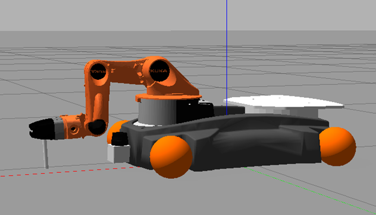

# Youbot




## Launch Simulation
**Terminal 1**
```sh
export GAZEBO_MODEL_PATH=$PWD/src/youbot_description/sdf
colcon build
ros2 launch youbot_description rviz.launch.py
```

**Terminal 2**
```sh
ros2 run youbot_fake_moveit controlArm
```

**Terminal 3**
```sh
ros2 run youbot_print printer
```

**Terminal 4**
```sh
ros2 run youbot_fake_moveit controlBase
```


## youbot_description
Robot description in form of SDF, URDF files and meshes   


This Youbot robot is a modified version of the [Youbot](http://www.youbot-store.com/) sold by Kuka until 2016 as part of an internship with the University of [Ostfalia](https://www.ostfalia.de/cms/de/i/), Wolfenbüttel.

```
robot name is: youbot
---------- Successfully Parsed XML ---------------
root Link: world has 1 child(ren)
    child(1):  virtual_link_xy
        child(1):  virtual_link_yz
            child(1):  base_footprint
                child(1):  base_link
                    child(1):  arm_link_0
                        child(1):  arm_link_1
                            child(1):  arm_link_2
                                child(1):  arm_link_3
                                    child(1):  arm_link_4
                                        child(1):  arm_link_5
                                            child(1):  pen
                    child(2):  base_laser_front_link
                    child(3):  caster_link_bl
                        child(1):  wheel_link_bl
                    child(4):  caster_link_br
                        child(1):  wheel_link_br
                    child(5):  caster_link_fl
                        child(1):  wheel_link_fl
                    child(6):  caster_link_fr
                        child(1):  wheel_link_fr
                    child(7):  plate_link

```

## youbot_fake_moveit
ROS package to control the Youbot   


## youbot_print
ROS package for 3D printing   