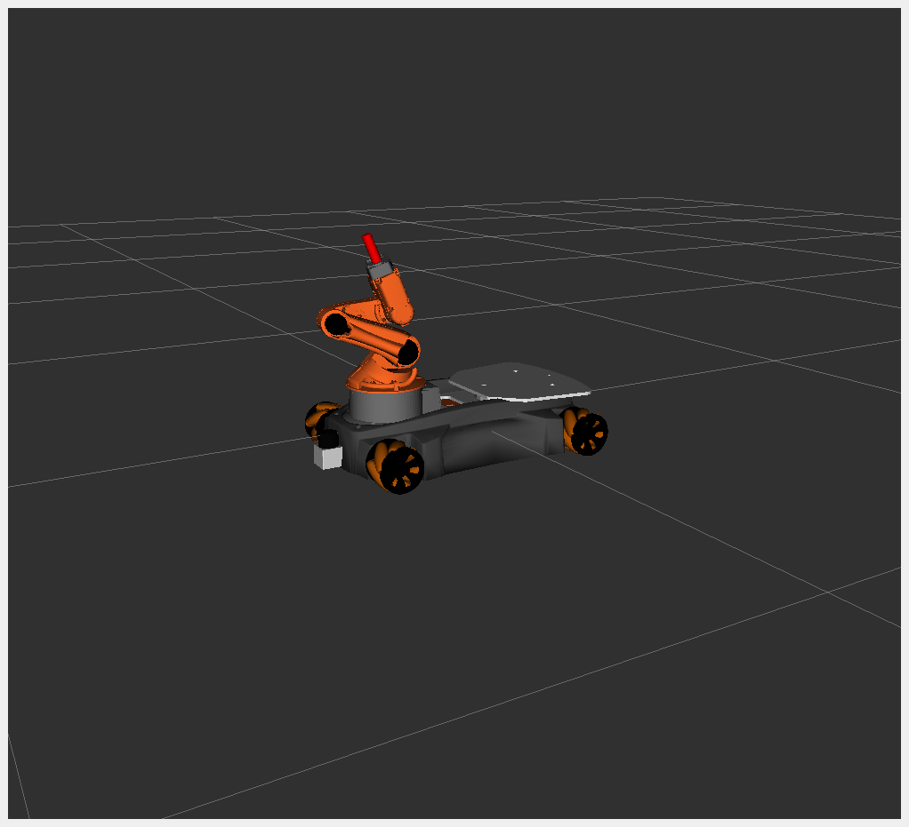

# Youbot_description

Robot description in form of URDF files and meshes

```
robot name is: youbot
---------- Successfully Parsed XML ---------------
root Link: base_footprint has 1 child(ren)
    child(1):  base_link
        child(1):  arm_link_0
            child(1):  arm_link_1
                child(1):  arm_link_2
                    child(1):  arm_link_3
                        child(1):  arm_link_4
                            child(1):  arm_link_5
                                child(1):  pen
                                    child(1):  printer
        child(2):  base_laser_front_link
        child(3):  caster_link_bl
            child(1):  wheel_link_bl
        child(4):  caster_link_br
            child(1):  wheel_link_br
        child(5):  caster_link_fl
            child(1):  wheel_link_fl
        child(6):  caster_link_fr
            child(1):  wheel_link_fr
        child(7):  plate_link

```

This Youbot robot is a modified version of the [Youbot](http://www.youbot-store.com/) sold by Kuka until 2016 as part of an internship with the University of [Ostfalia](https://www.ostfalia.de/cms/de/i/), Wolfenbüttel.





## Launch Rviz
```sh
cd youbot_description
colcon build
ros2 launch youbot_description rviz.launch.py
```

## Launch Gazebo
```sh
cd youbot_description
colcon build
export GAZEBO_MODEL_PATH=$PWD/src/youbot_description/sdf
ros2 launch youbot_description gazebo.launch.py
```

## Examples
### Move joint (Gazebo)
```sh
# launch gazebo
ros2 topic pub /youbot/set_joint_trajectory trajectory_msgs/msg/JointTrajectory "{header: {frame_id: world}, joint_names: {youbot::arm_joint_1, youbot::arm_joint_2, youbot::arm_joint_3, youbot::arm_joint_4, youbot::arm_joint_5}, points: [{positions: {3.1, 3.0, -1.0, 0.3, 2.9}}]}"
```

Arm (start) : 
    arm_joint_1 : 3.14
    arm_joint_2 : 3.0
    arm_joint_3 : -1.0
    arm_joint_4 : 0.3
    arm_joint_5 : 2.9
